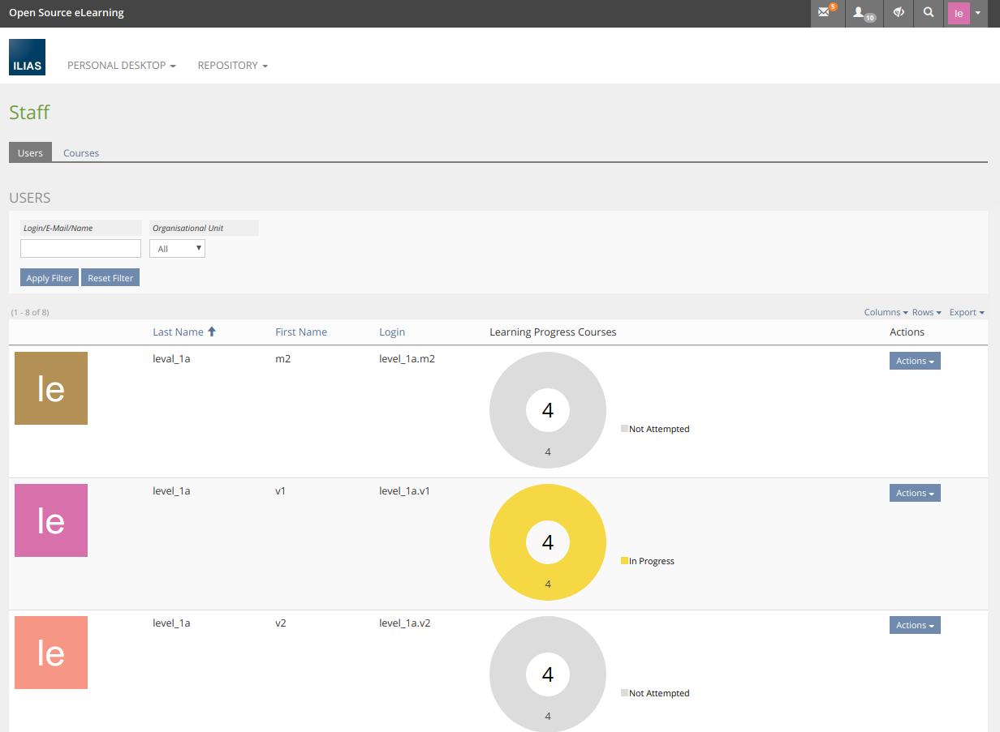
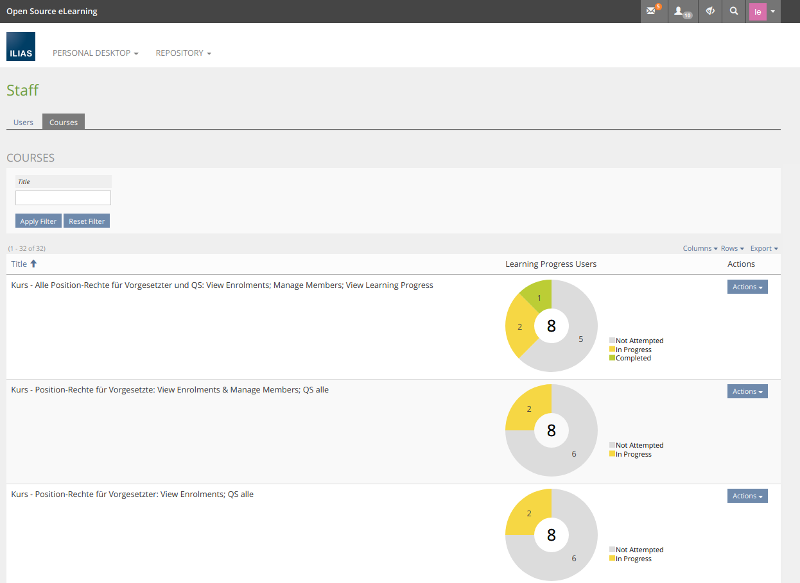

## Installation

### Install SrLpReport-Plugin
Start at your ILIAS root directory
```bash
mkdir -p Customizing/global/plugins/Services/UIComponent/UserInterfaceHook
cd Customizing/global/plugins/Services/UIComponent/UserInterfaceHook
git clone https://github.com/fluxapps/SrLpReport.git SrLpReport
```
Update, activate and config the plugin in the ILIAS Plugin Administration

### Some screenshots
Staff users:


Staff courses:


Course report:


### Requirements
* ILIAS 6 or ILIAS 7
* PHP >=7.2


### ILIAS Plugin SLA
Wir lieben und leben die Philosophie von Open Source Software! Die meisten unserer Entwicklungen, welche wir im Kundenauftrag oder in Eigenleistung entwickeln, stellen wir öffentlich allen Interessierten kostenlos zur Verfügung.

Setzen Sie eines unserer Plugins professionell ein? Sichern Sie sich mittels SLA die termingerechte Verfügbarkeit dieses Plugins auch für die kommenden ILIAS Versionen.

Bitte beachten Sie, dass wir nur Institutionen, welche ein SLA abschliessen Unterstützung und Release-Pflege garantieren.
